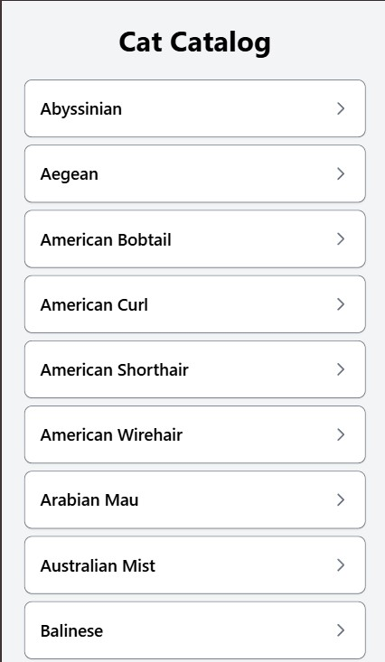
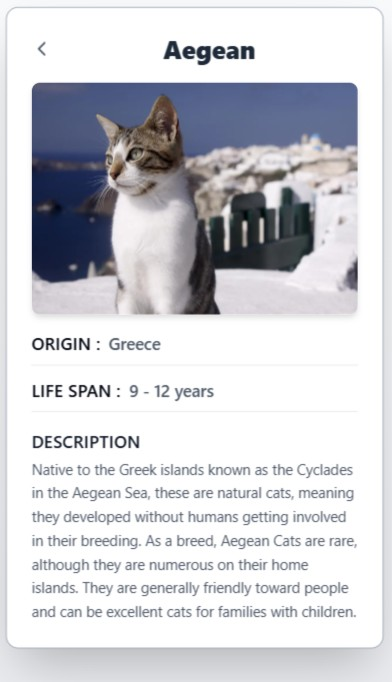

# 🐾 Cat Catalog


**Cat Catalog** is a modern web application designed for cat enthusiasts to explore various cat breeds. Built with Next.js, TypeScript, and Tailwind CSS, this project utilizes The Cat API to fetch and display breed data in an elegant and user-friendly interface. The application features a clean home page listing all cat breeds and a detailed view for each breed, complete with images and key information.

---

## 📋 Table of Contents
- [Features](#-features)
- [Tech Stack](#-tech-stack)
- [Setup Instructions](#-setup-instructions)
- [Usage](#-usage)
- [Project Structure](#-project-structure)
- [Future Improvements](#-future-improvements)

---

## ✨ Features

### **Home Page**
- Displays a list of cat breeds in a card-based layout.
- Each card includes:
  - A border, shadow, and interactive hover effects (background color change, scaling, and shadow increase).

### **Breed Detail Page**
- Provides detailed information about a selected breed, including:
  - Breed name with a back arrow for navigation.
  - An image of the breed (with a placeholder if no image is available).
  - Key details such as origin, lifespan, and description, presented in a compact card layout.
  - Inline label-value pairs for origin and lifespan (e.g., `ORIGIN: United States`, `LIFE SPAN: 12 - 15 years`).
- Optimized image loading with Next.js `Image` component and `sizes` prop.

### **Responsive Design**
- Fully responsive layout, ensuring a seamless experience on both desktop and mobile devices.

### **Animations**
- Subtle animations, including a fade-in effect on the breed detail page and hover effects on list items and images.

### **Performance Optimization**
- Uses Next.js server-side rendering and image optimization for enhanced performance.

---

## 🛠️ Tech Stack

- **Next.js**: React framework for server-side rendering and static site generation.
- **TypeScript**: Adds type safety for a better developer experience.
- **Tailwind CSS**: Utility-first CSS framework for rapid and consistent styling.
- **The Cat API**: External API for fetching cat breed data and images.
- **GitHub**: Version control and repository hosting.

---

## ⚙️ Setup Instructions

### **Prerequisites**
Ensure you have the following installed:

- **Git**: [Download here](https://git-scm.com/) or install via a package manager (e.g., `brew install git` on macOS, `apt install git` on Ubuntu).
- **Node.js**: Version 14 or higher. [Download here](https://nodejs.org/), or install via a package manager (e.g., `brew install node` on macOS). Verify your version:
  ```bash
  node -v
  ```
- **npm**: Included with Node.js. Verify your version:
  ```bash
  npm -v
  ```

### **Installation Steps**

#### **1. Clone the Repository**
```bash
git clone https://github.com/chamath09/Cat-catalog.git
cd cat-catalog
```

#### **2. Install Dependencies**
```bash
npm install
```
This will install Next.js, TypeScript, Tailwind CSS, and other dependencies listed in `package.json`.

#### **3. Verify The Cat API Access**
The project uses The Cat API to fetch breed data. If you extend the API usage (e.g., for authenticated endpoints), sign up for an API key and add it to a `.env.local` file:
```env
CAT_API_KEY=your-api-key-here
```
Update `app/api/catBreeds.ts` to include the API key in the fetch request if necessary.

#### **4. Run the Development Server**
```bash
npm run dev
```
The application will be available at [http://localhost:3000](http://localhost:3000).

#### **5. Build for Production (Optional)**
```bash
npm run build
npm run start
```
The production build will also be accessible at [http://localhost:3000](http://localhost:3000).

---

## 🚀 Usage

### **Home Page**
- Navigate to `http://localhost:3000` after starting the development server.
- Browse a list of cat breeds displayed in a card layout with hover effects.
- Click on a breed to view its details.

### **Breed Detail Page**
- View detailed information about a selected breed, including:
  - Name, image, origin, lifespan, and description.
  - Inline details (e.g., `ORIGIN: United States`, `LIFE SPAN: 12 - 15 years`).
- Use the back arrow to return to the home page.
- If a breed is not found, a "Breed Not Found" message with a "Back to Home" button is displayed.

---

## 📂 Project Structure

```plaintext
cat-catalog/
├── app/
│   ├── api/
│   │   └── catBreeds.ts        # API logic to fetch cat breed data from The Cat API
│   ├── breed/
│   │   └── [id]/
│   │       └── page.tsx        # Breed detail page with compact card design
│   ├── globals.css             # Global styles with Tailwind CSS and animations
│   ├── layout.tsx              # Root layout for the application
│   └── page.tsx                # Home page with list of cat breeds
├── public/
│   └── favicon.ico             # Favicon for the application
├── .gitignore                  # Git ignore file
├── eslint.config.mjs           # ESLint configuration
├── package-lock.json           # Dependency lock file
├── package.json                # Project metadata and dependencies
├── postcss.config.mjs          # PostCSS configuration
├── README.md                   # Project documentation (this file)
├── tailwind.config.js          # Tailwind CSS configuration
└── tsconfig.json               # TypeScript configuration
```

---

## 🔮 Future Improvements
- **Search Functionality**: Add a search bar to filter cat breeds by name.
- **Loading States**: Implement loading spinners during API data fetching.
- **Error Handling**: Enhance API error handling with retry logic and user-friendly messages.
- **Pagination**: Introduce pagination or infinite scroll for large breed lists.
- **Dark Mode**: Add a dark mode toggle for improved accessibility.
- **Testing**: Incorporate unit and integration tests using Jest or Cypress.

---
## 📸 Screenshots





---